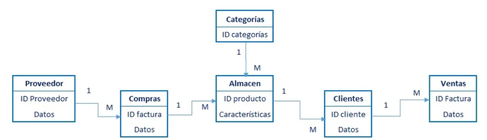
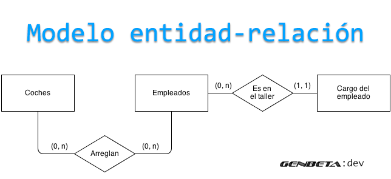
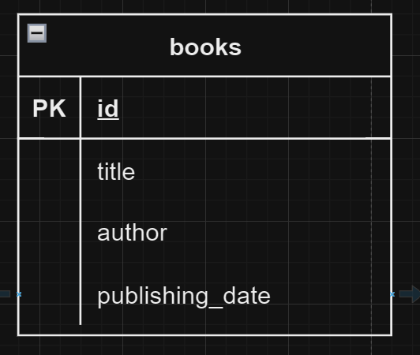
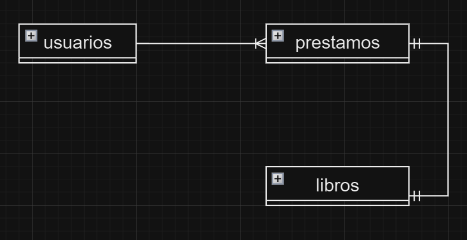
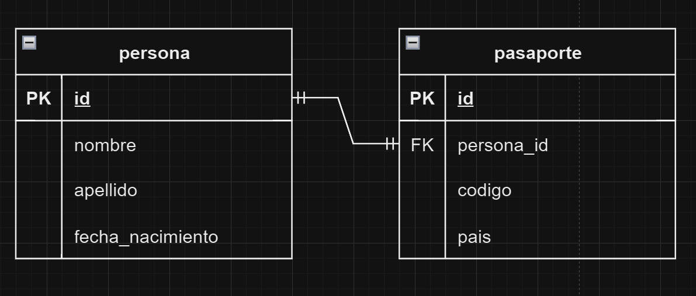
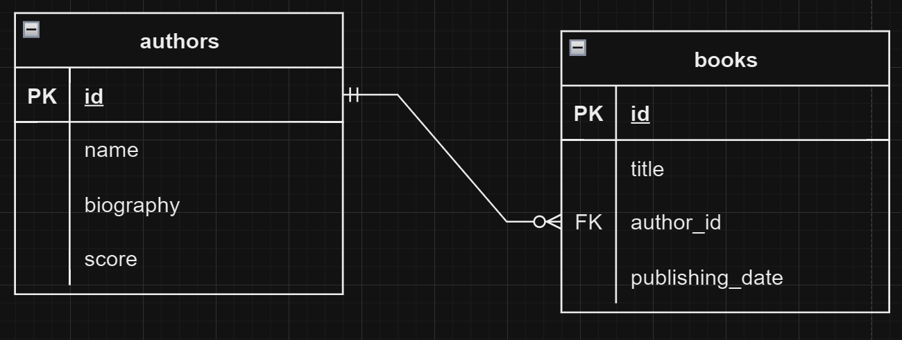
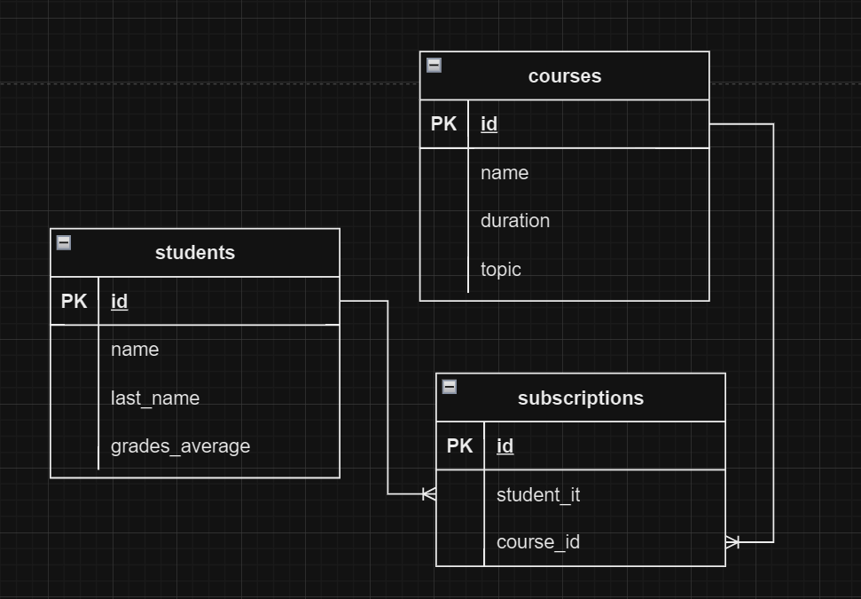
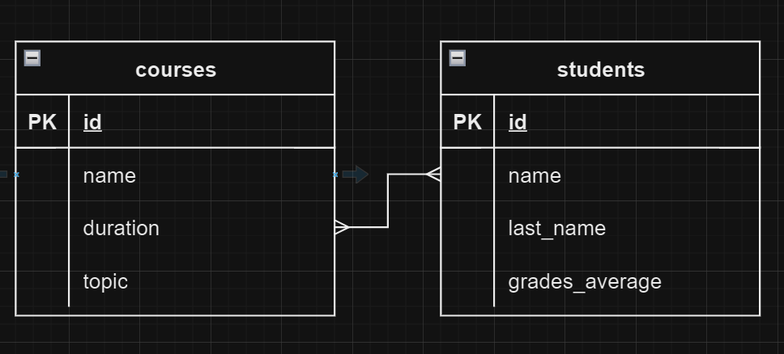

# Taller: Introducción al Diseño de Bases de Datos relacionales

## Objetivos

1. **Memorizar** los conceptos básicos de bases de datos relacionales.
2. **Comprender** y aplicar los conceptos de entidades, atributos y relaciones.
3. **Aplicar** los diferentes tipos de cardinalidad en un diagrama entidad-relación (ER).
4. **Analizar** y diseñar diagramas entidad-relación (ER) utilizando rombos, cuadrados y óvalos.
5. **Evaluar** la estructura de un modelo entidad-relación y sugerir mejoras.
6. **Crear** un modelo entidad-relación completo para un sistema de información específico.

## Contenidos

1. **Recordar**: Conceptos básicos de bases de datos relacionales.
2. **Comprender**: Identificación de entidades, atributos, claves primarias (PK), claves foráneas (FK) y relaciones.
3. **Aplicar**: Tipos de cardinalidad:
   - Uno a Uno (1:1).
   - Uno a Muchos (1:N).
   - Muchos a Muchos (M:N).
4. **Analizar**: Diferencias entre el modelo relacional y el modelo entidad-relación.
5. **Crear**: Diagramas entidad-relación (ER) utilizando herramientas de diseño.

## Recursos

- [Herramientas de Diseño de Diagramas ER](../RESOURCES.md#herramientas-de-diseño-de-diagramas-er)

## Instrucciones de entrega

- **Repositorio en github:** Crear un repositorio en github con el nombre `databases-workshop-1`.
- **Estructura de carpetas:** Crear una carpeta para cada ejercicio con el nombre `exercise-1`, `exercise-2`, `exercise-3`, `exercise-4`.
- **Diagramas ER:** Incluir imagenes (PNG, JPG) de los diferentes modelos relacionales en cada carpeta de ejercicio. Puedes lograr esto tomando capturas de pantalla de la herrammienta de diseño que utilices.

## Introducción Teórica

### Bases de Datos Relacionales

**Definición y Propósito de una Base de Datos**

Las bases de datos son sistemas que permiten almacenar, organizar y recuperar información de manera eficiente. Su objetivo es proporcionar un mecanismo para gestionar grandes volúmenes de datos. Las características clave de una base de datos incluyen:

- **Estructura:** Organización de los datos en tablas, filas y columnas.
- **Integridad:** Garantizar que los datos sean precisos y consistentes.
- **Seguridad:** Controlar el acceso a los datos y proteger la información sensible.
- **Consultas:** Realizar búsquedas y análisis de datos de manera eficiente.

### Sistema de Bases de Datos Relacionales (RDBMS)

- **Definición:** Un sistema de bases de datos relacionales (RDBMS) es un tipo de base de datos que utiliza un modelo relacional para organizar y gestionar los datos.
- **Ejemplos:** Algunos ejemplos populares de RDBMS incluyen MySQL, PostgreSQL, Oracle Database y SQL Server.
- **Ventajas:** Las bases de datos relacionales ofrecen ventajas como la estructura tabular, la integridad de los datos, la flexibilidad y la escalabilidad.
- **Componentes:** Un sistema de bases de datos relacionales consta de varios componentes que trabajan juntos para almacenar y gestionar los datos. Dentro de los componentes se encuentran:
  - **Motor de Base de Datos:** Software que gestiona el almacenamiento y recuperación de datos.
  - **Lenguaje de Consulta:** Permite a los usuarios interactuar con la base de datos para realizar operaciones como consultas, inserciones, actualizaciones y eliminaciones.
  - **Modelo de Datos:** Define la estructura y organización de los datos en la base de datos.
  - **Interfaz de Usuario:** Permite a los usuarios interactuar con la base de datos a través de una interfaz gráfica o de línea de comandos.

### Diferencias entre Datos e Información

- **Datos:** Hechos o cifras sin procesar.
- **Información:** Resultado de procesar y analizar los datos para obtener significado y contexto.

**Ejemplo:** Los números de ventas de una empresa representan datos. Al analizar esos números para identificar tendencias, patrones o áreas de mejora, se convierten en información.

### Modelos de Datos

- **Definición:** Dentro de un sistema de bases de datos, los modelos de datos son representaciones abstractas de la estructura y organización de los datos. Los modelos de datos permiten definir cómo se almacenan, acceden y manipulan los datos en la base de datos. Dentro de las categorías de modelos de datos, se encuentran:

  - **Modelo Relacional:** Organiza los datos en tablas con filas y columnas.

  

  - **Modelo de Entidad-Relación (ER):** Representa las entidades, atributos y relaciones especificas a traves de un verbo entre los datos.

  

  - **Nota**: En este taller, nos centraremos en el modelo relacional.

Para ambos modelos, es fundamental comprender los siguientes conceptos:

### Entidades

- **Definición:** Representan objetos o conceptos importantes dentro del contexto de una base de datos. Son elementos fundamentales que necesitan ser definidos y gestionados.
- **Ejemplos:** En un sistema de gestión de biblioteca, las entidades pueden incluir `Libro`, `Usuario` y `Préstamo`.

  

- **Importancia:** Las entidades son la base sobre la cual se construye el modelo de datos, permitiendo una organización clara y estructurada de la información.

### Atributos

- **Definición:** Propiedades o características de las entidades que describen sus detalles específicos.
- **Ejemplos:** Para la entidad `Libro`, los atributos podrían incluir `Título`, `Autor`, `Fecha de publicación`.

  

- **Tipos de Atributos:** Los atributos pueden ser de diversos tipos, como texto, numéricos, fechas, booleanos, entre otros. Aunque en este taller no profundizaremos en los tipos de datos específicos para los diagramas, es crucial reconocer que los atributos pueden variar en su tipo de dato, lo que influye en cómo se almacenan y manipulan en la base de datos.
- **Importancia:** Los atributos proporcionan información detallada sobre cada entidad, permitiendo una descripción precisa y útil de los datos.

### Claves en Bases de Datos

- **Clave Primaria (PK):** Un atributo o un conjunto de atributos que identifican de manera única cada registro en una tabla. Por ahora, entenderemos que la clave primaria es un identificador único para cada entidad en la base de datos.
- **Clave Foránea (FK):** Un atributo o un conjunto de atributos en una tabla que se refiere a la clave primaria de otra tabla, estableciendo una relación entre las dos tablas. Por ahora, entenderemos que la clave foránea es un identificador que conecta dos entidades en la base de datos.

### Relaciones

- **Definición:** Cómo las entidades están relacionadas entre sí, estableciendo conexiones entre ellas.
- **Ejemplos:** En un sistema de gestión de biblioteca, un `Usuario` puede tener muchos `Préstamos`. Un `Préstamo` está relacionado con un `Libro`.

  

- **Importancia:** Las relaciones permiten definir cómo interactúan las entidades, facilitando consultas y operaciones complejas en la base de datos.

### Cardinalidad en Relaciones

**Uno a Uno (1:1)**

- **Definición:** Cada entidad en el conjunto A se relaciona con una sola entidad en el conjunto B y viceversa.
- **Ejemplo Real:** Un ejemplo de la vida real podría ser la relación entre `Persona` y `Pasaporte`, donde cada persona tiene un único pasaporte y cada pasaporte pertenece a una sola persona.

  

- **Nota:** La cardinalidad Uno a Uno es menos común en bases de datos, pero puede ser útil para relaciones directas y exclusivas entre entidades. En este caso utilizamos la figura de relación en draw.io **_one to one_**, mas adelante entenderemos que esto se refiere a que una persona tiene un pasaporte y un pasaporte pertenece a una persona.

- **Uso:** Este tipo de relaciones no especifican la naturaleza de la relación, o sea, quien es la entidad débil y quien es la entidad fuerte, por lo que se puede utilizar en cualquier caso donde se requiera una relación uno a uno.

**Uno a Muchos (1:N)**

- **Definición:** Una entidad en el conjunto A se relaciona con muchas entidades en el conjunto B.
- **Ejemplo Real:** Un `Autor` puede escribir muchos `Libros`, pero cada `Libro` tiene un único `Autor`.

  

- **Nota:** La cardinalidad Uno a Muchos es la más común en bases de datos relacionales. En este ejemplo utilizamos la figura de relación en draw.io **_one mandatory to many optional_**, mas adelante entenderemos que esto se refiere a que un autor puede escribir muchos libros, pero un libro solo puede tener un autor.

- **Uso:** Este es un tipo de relación muy común en bases de datos, permitiendo que una entidad principal esté vinculada a múltiples entidades secundarias.

**Muchos a Muchos (M:N)**

- **Definición:** Muchas entidades en el conjunto A se relacionan con muchas entidades en el conjunto B.
- **Ejemplo Real:** Los `Estudiantes` pueden inscribirse en muchos `Cursos`, y cada `Curso` puede tener muchos `Estudiantes`.

  

- **Nota 1:** La cardinalidad Muchos a Muchos es común en situaciones donde las entidades pueden tener múltiples relaciones con otras entidades. En este ejemplo, utilizamos una tercera tabla llamada Inscripciones para representar la relación entre Estudiantes y Cursos. Observa que la relación entre Estudiantes e Inscripciones es de uno a muchos, así tambien como la relación entre cursos e Inscripciones tambien es de uno a muchos. Por esta razón, utilizamos la relación **_one mandatory to many optional_** en draw.io para representar la relación entre Inscripciones y Estudiantes, así como entre Inscripciones y Cursos.

  

- **Nota 2:** Es importante destacar que también podríamos utilizar la relación many to many para representar directamente la relación entre Estudiantes y Cursos. Sin embargo, en este caso, optamos por la relación one mandatory to many optional hacia la tercera tabla Inscripciones para una representación más detallada y estructurada de la relación.

- **Uso:** Esta relación se maneja generalmente a través de una tabla intermedia que contiene las claves primarias (PK) de ambas entidades, como `Inscripciones` para estudiantes y cursos.

## Actividades Prácticas

### Ejercicio 1: Identificación de Entidades y Relaciones

**Descripción:**

- **Identificar** las entidades principales, sus atributos y las relaciones entre ellas en un caso de estudio de un sistema de gestión de biblioteca.

**Historia de Usuario: Sistema de Gestión de Biblioteca**

- En una biblioteca, los usuarios pueden tomar prestados libros. Cada libro tiene un título, un autor y una fecha de publicación. Los usuarios tienen un nombre, una dirección y un email. Cada vez que un usuario toma prestado un libro, se registra un préstamo, incluyendo la fecha de préstamo y la fecha de devolución.

**Objetivos:**

- **Recordar** los conceptos básicos de entidades y relaciones en bases de datos.
- **Comprender** la estructura de una base de datos a través de la identificación de entidades, atributos y relaciones.
- **Aplicar** los conceptos de claves primarias (PK) y claves foráneas (FK).

**Actividades:**

1. **Lectura y Discusión:**

   - Leer la historia de usuario e identificar las entidades principales (`Libro`, `Usuario`, `Préstamo`).
   - Listar los posibles atributos de cada entidad.

2. **Identificación de Entidades y Atributos:**

   - Identificar y listar las entidades (`Libro`, `Usuario`, `Préstamo`).
   - Para cada entidad, listar al menos cinco atributos relevantes (`Título`, `Autor`, `Fecha de Publicación` para `Libro`; `Nombre`, `Dirección`, `Email` para `Usuario`; `Fecha de Préstamo`, `Fecha de Devolución` para `Préstamo`).

3. **Determinación de Claves:**

   - Identificar las claves primarias (PK) para cada entidad.
   - Identificar las claves foráneas (FK) que establecen las relaciones entre entidades (`Libro` a `Préstamo`, `Usuario` a `Préstamo`).
   
### Ejercicio 2: Comprensión de la Cardinalidad

**Descripción:**

- Explicación detallada de los diferentes tipos de cardinalidad utilizando ejemplos prácticos y gráficos.
- Los estudiantes analizarán la cardinalidad de las relaciones en el caso de estudio.

**Tipos de Cardinalidad:**

- **Uno a Uno (1:1):**

  - **Definición:** Cada entidad en el conjunto A se relaciona con una sola entidad en el conjunto B y viceversa.
  - **Ejemplo Real:** En una ciudad, cada persona tiene un único pasaporte, y cada pasaporte pertenece a una sola persona.
  - **Gráfico:**

- **Uno a Muchos (1:N):**

  - **Definición:** Una entidad en el conjunto A se relaciona con muchas entidades en el conjunto B.
  - **Ejemplo Real:** Un autor puede escribir muchos libros, pero cada libro tiene un único autor.
  - **Gráfico:**

- **Muchos a Muchos (M:N):**
  - **Definición:** Muchas entidades en el conjunto A se relacionan con muchas entidades en el conjunto B.
  - **Ejemplo Real:** Los estudiantes pueden inscribirse en muchos cursos, y cada curso puede tener muchos estudiantes.
  - **Gráfico:**

**Objetivos:**

- **Comprender** los diferentes tipos de cardinalidad en las relaciones de bases de datos.
- **Aplicar** la cardinalidad adecuada a las relaciones identificadas en el caso de estudio.
   - Crear ejemplos adicionales en grupos donde los estudiantes definan entidades y relaciones con diferentes cardinalidades.
   - Presentar los ejemplos creados y explicar las decisiones tomadas.

### Ejercicio 3: Creación de un Modelo Relacional

**Descripción:**

- Los estudiantes crearán un modelo relacional basado en el caso de estudio del sistema de gestión de biblioteca.
- Deberán representar las entidades, atributos y relaciones, incluyendo las cardinalidades apropiadas.

**Historia de Usuario:**

- En la biblioteca, cada libro puede ser prestado muchas veces, pero cada préstamo corresponde a un único libro. Un usuario puede tomar prestados varios libros, y cada préstamo corresponde a un único usuario.

**Objetivos:**

- **Aplicar** los conocimientos adquiridos para diseñar un modelo relacional.
- **Crear** un modelo relacional claro y preciso.

**Actividades:**

1. **Revisión de Requerimientos:**

   - Revisar los requerimientos del caso de estudio.

2. **Diseño del Modelo Relacional:**
   - Utilizando una herramienta de diseño (por ejemplo, draw.io), crear un modelo relacional que incluya:
     - Entidades (`Libro`, `Usuario`, `Préstamo`) representadas por rectángulos.
     - Atributos de cada entidad representados por nombres de atributos dentro de los rectángulos.
     - Claves primarias (PK) y claves foráneas (FK) representadas por líneas y flechas.
     - Relaciones entre entidades representadas por líneas con la cardinalidad apropiada.
     - Cardinalidades de las relaciones (`Usuario` a `Préstamo`: 1:N; `Libro` a `Préstamo`: 1:N).

### Ejercicio 4: Casos Adicionales para Practicar y Afianzar el Aprendizaje

**Descripción:**

- Se presentarán 5 casos adicionales para que los estudiantes practiquen el diseño de modelos relacionales.

**Objetivos:**

- **Evaluar** la habilidad de los estudiantes para aplicar los conceptos aprendidos en nuevos contextos.
- **Crear** modelos relacionales completos y precisos para diferentes sistemas de información.

**Historias de Usuario:**

1. **Sistema de Gestión de Ventas:**

   - En una tienda, cada producto tiene un nombre y un precio. Los clientes realizan pedidos, y cada pedido puede incluir varios productos. Un cliente puede hacer muchos pedidos, y cada pedido pertenece a un único cliente.

2. **Sistema de Gestión de Hospital:**

   - En un hospital, cada paciente puede tener citas con varios médicos. Los médicos pueden atender a muchos pacientes. Cada cita incluye la fecha de la cita y el diagnóstico.

3. **Sistema de Gestión de Universidad:**

   - En una universidad, los estudiantes se inscriben en cursos. Cada curso tiene un nombre y un código. Los estudiantes pueden estar inscritos en muchos cursos, y cada curso puede tener muchos estudiantes inscritos.

4. **Sistema de Gestión de Recursos Humanos:**

   - En una empresa, los empleados trabajan en proyectos. Cada proyecto tiene un nombre y una fecha de inicio. Un empleado puede trabajar en varios proyectos, y cada proyecto puede tener varios empleados asignados.

5. **Sistema de Gestión de Inventario:**

   - En un almacén, los productos son suministrados por proveedores. Cada producto tiene un nombre y una cantidad en stock. Un proveedor puede suministrar muchos productos, y cada producto puede ser suministrado por varios proveedores.
